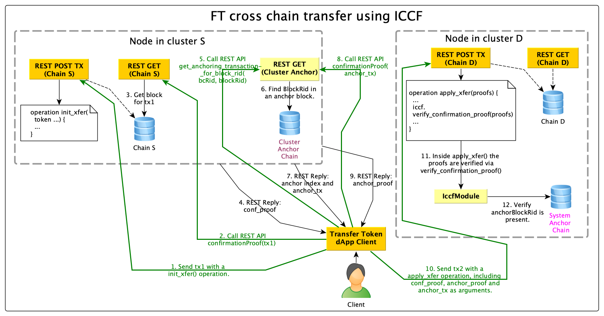

# How to build a client that supports ICCF

This documentation is intended for client developers that want to build support for ICCF in their client.

Kotlin reference implementation [IccfProofTxMaterialBuilder](https://gitlab.com/chromaway/core/postchain-client/-/blob/dev/chromia-client/src/main/kotlin/net/postchain/d1/iccf/IccfProofTxMaterialBuilder.kt).

## Client provider

It is highly recommended that you build support in your client for node discovery via management chain (chain 0).

Specifically this means building a utility function that given a blockchain RID returns a client for that blockchain with all the nodes running the chain as possible endpoint URLs.

This can be done by querying management chain with query `cm_get_blockchain_api_urls(blockchain_rid: byte_array)`. \
See [ChromiaClientProvider](https://gitlab.com/chromaway/core/postchain-client/-/blob/dev/chromia-client/src/main/kotlin/net/postchain/d1/client/ChromiaClientProvider.kt) as a reference.

## Intra network

Your client needs to take the following steps given a source blockchain RID and a transaction RID to prove:

1. Fetch a proof that the transaction occurred on source chain by calling endpoint `/tx/{SOURCE_BLOCKCHAIN_RID}/{TX_RID}/confirmationProof`. You may want to verify that this transaction is the same transaction that the client is expecting. Please see [Transaction hash verification](#transaction-hash-verification-optional) for how to ensure that.
2. Now it is time to calculate the block RID of the source block header that is included in the proof response. This is done in two steps:
    1. Decode the response from proof endpoint as a GTV dictionary and retrieve the field "blockHeader" as a byte array.
    2. Decode that byte array as a GTV and compute its merkle hash.
3. With this block RID we can now query for the transaction in the cluster anchoring chain in which the block was anchored by calling the query `get_anchoring_transaction_for_block_rid(blockchain_rid: byte_array, block_rid: byte_array)` with the given source blockchain RID and the calculated block RID. (Note: to get the blockchain RID of the cluster anchoring chain you can query management chain with `cm_get_cluster_info(name: text)`)
4. From the response of the previous query you can then fetch a proof from the cluster anchoring chain that this transaction has occurred by calling `/tx/{CLUSTER_ANCHORING_BLOCKCHAIN_RID}/{CLUSTER_ANCHORING_TX_RID}/confirmationProof`.
5. Now you can construct an ICCF proof operation that the user can post to the target chain. The operation has the name `iccf_proof` and has the following input parameters:
    1. Source blockchain RID, type: `ByteArray`
    2. Source transaction hash (included in proof GTV in field "hash"), type: `ByteArray`
    3. Source transaction proof (The whole response in step 1), type: `ByteArray`
    4. Cluster anchoring transaction (From response in step 3), type: `ByteArray`
    5. Cluster anchoring transaction operation index (From response in step 3), type: `Integer`
    6. Cluster anchoring proof (The whole response in step 4), type: `ByteArray`

The best way to return this operation to the user depends on client implementation. In the kotlin reference client it is returned as a transaction builder with the operation included.

The idea is that the proof operation is included in the same transaction as an operation that wants to check the proof so that is why returning a transaction builder is quite natural.

Example flow for FT library:

## Intra cluster optimization

If source and target blockchain is in the same cluster there is an optimized version of ICCF. You only need to execute step 1. in the intra-network flow and then construct the proof operation with name `iccf_proof` with the following parameters:
1. Source blockchain RID, type: `ByteArray`
2. Source transaction hash (included in proof GTV in field "hash"), type: `ByteArray`
3. Source transaction proof (The whole response in step 1), type: `ByteArray`

You can make this optimization automatically by asking the user to input both source and target blockchain RID. Then you can query management chain to see if they are indeed in the same cluster by using the query `cm_get_blockchain_cluster(brid: byte_array)`. Just make sure that user can override this automation since certain dApps may not accept this optimized proof version.

## Transaction hash verification (optional)

You can ask the user to input the transaction hash and signers that it is expecting it to have. If the hash in the returned proof is mismatching with user inputted hash you can verify if it is just the signature data that has been re-arranged or if the signatures are actually different from what the client is expecting.

You can get the full stored transaction from a node by querying `/tx/{SOURCE_BLOCKCHAIN_RID}/${TX_RID}`. Decode the returned hex string to GTX format and verify that the signature data contains the expected signatures.